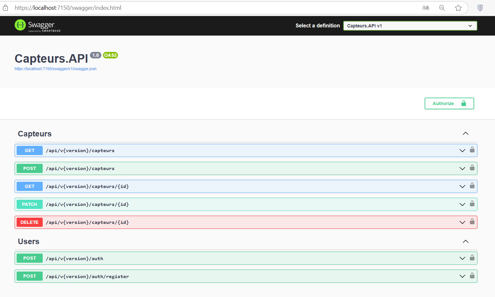
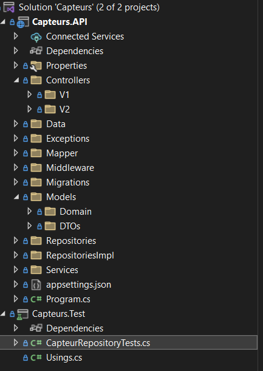
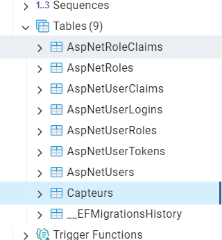
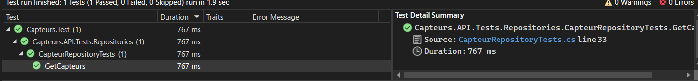

# Capteurs API

## Description

Capteurs API is a robust RESTful API built with .NET 7 that supports CRUD operations for managing sensor data (Capteurs). The API is designed to be secure and efficient, incorporating JWT authentication and authorization, caching mechanisms, versioning, and comprehensive documentation using Swagger.

## Features

- **CRUD Operations**: Create, Read, Update, and Delete operations for managing Capteurs.
- **PostgreSQL Database**: Utilizes PostgreSQL for data storage.
- **Authentication & Authorization**: Secured with JWT tokens.
- **Caching Mechanism**: Improves performance by caching frequently accessed data.
- **Versioning**: Supports multiple versions of the API.
- **API Documentation**: Interactive documentation provided by Swagger.
- **Unit Testing**: Comprehensive tests implemented using xUnit.
- **Error Handling**: Centralized error handling using middleware.

## Getting Started

### Prerequisites

- [.NET 7 SDK](https://dotnet.microsoft.com/download/dotnet/7.0)
- [PostgreSQL](https://www.postgresql.org/download/)
- [Visual Studio](https://visualstudio.microsoft.com/) or [Visual Studio Code](https://code.visualstudio.com/)

## Screenshots

### API Documentation

### Code Structure

### Postgres Db

### Test

